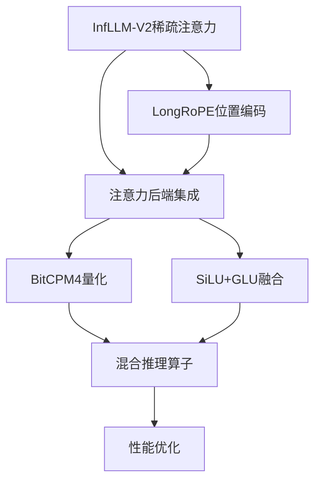

# MiniCPM与FastDeploy自定义算子分析报告

基于对FastDeploy现有算子和MiniCPM仓库的深入分析，本报告详细说明了为MiniCPM4.1-8B模型集成到FastDeploy所需实现的自定义算子。

## 一、MiniCPM技术特点分析

### 1.1 核心架构特征
通过分析MiniCPM的技术文档和现有代码，MiniCPM4.1-8B具有以下关键特征：

**模型规格**：
- 8B参数的大型语言模型
- 支持超长上下文（8K-128K tokens）
- 混合精度推理支持
- 多模态处理能力

**核心创新技术**：
1. **InfLLM-V2稀疏注意力**：训练可学习的稀疏注意力机制
2. **Multi-Head Latent Attention (MLA)**：多头潜在注意力
3. **LongRoPE**：扩展的旋转位置编码
4. **混合推理模式**：支持不同的推理优化策略

## 二、FastDeploy现有算子基础设施

### 2.1 现有注意力算子
FastDeploy已经实现了丰富的注意力算子库：

**核心注意力算子**：
```cpp
// append_attention.cu - 稀疏注意力核心实现
void AppendAttentionKernel() {
    // 支持分块KV缓存、量化、RoPE等
}

// multi_head_latent_attention.cu - 多头潜在注意力
std::vector<paddle::Tensor> MultiHeadLatentAttentionKernel() {
    // MLA实现，支持缓存管理
}
```

**现有功能支持**：
- **Append Attention**：高效稀疏注意力，支持TopK选择
- **MLA Attention**：多头潜在注意力，支持潜维度压缩
- **分块KV缓存**：高效的键值缓存管理
- **量化支持**：W8A16、W4A8、FP8等多种量化格式
- **RoPE支持**：旋转位置编码集成
- **多硬件支持**：GPU、CPU、XPU、NPU适配

### 2.2 现有算子文件结构
```
custom_ops/gpu_ops/
├── append_attention.cu              # 核心稀疏注意力实现
├── multi_head_latent_attention.cu   # MLA注意力实现
├── append_attn/                     # 注意力kernel目录
│   ├── append_attention_kernel.h
│   ├── decoder_write_cache_with_rope_kernel.h
│   ├── encoder_write_cache_with_rope_kernel.h
│   └── speculate_write_cache_with_rope_kernel.h
├── mla_attn/                        # MLA kernel目录
│   └── batch_mla_with_paged_kv_cache.h
├── fused_rotary_position_encoding.cu # RoPE融合算子
├── beam_search_softmax.cu           # Beam搜索优化
└── quantization/                    # 量化算子目录
```

## 三、MiniCPM需要新增的自定义算子

### 3.1 高优先级算子

#### 3.1.1 InfLLM-V2动态稀疏注意力算子
**功能**：实现MiniCPM特有的可训练稀疏注意力机制

**技术特点**：
```python
# MiniCPM4.1稀疏注意力参数
infllm_config = {
    'kernel_size': 32,        # 语义核大小
    'kernel_stride': 16,      # 核间步长
    'block_size': 64,         # KV块大小
    'topk': 64,              # 每个token关注的top-k块
    'dense_len': 8192,       # 稀疏/密集注意力阈值
    'nope': True,            # 不使用位置编码的性能优化
}
```

**实现方案**：
```cpp
// custom_ops/gpu_ops/infllmv2_attention.cu
template <paddle::DataType D>
void InfLLMV2AttentionKernel(
    const paddle::Tensor& query,                    // [bs, seq_len, num_heads, head_dim]
    const paddle::Tensor& key_cache,                // 分块KV缓存
    const paddle::Tensor& value_cache,
    const paddle::Tensor& block_tables,             // 块表映射
    const paddle::Tensor& kernel_select_mask,       // 动态核选择掩码
    const paddle::Tensor& topk_indices,             // TopK相关块索引
    const int kernel_size,
    const int kernel_stride,
    const int topk,
    paddle::Tensor& output                         // 输出注意力结果
) {
    // CUDA kernel实现
    // 1. 动态核选择算法
    // 2. 块级稀疏注意力计算
    // 3. 内存访问优化
}
```

**性能目标**：
- 在128K上下文下，仅需5%的token-to-token计算
- 相比标准注意力实现7x解码加速

#### 3.1.2 LongRoPE扩展位置编码算子
**功能**：支持64K+上下文的旋转位置编码

**技术特点**：
```python
longrope_config = {
    'max_position_embeddings': 65536,  # 最大位置
    'scaling_factor': 2.0,              # 长度扩展因子
    'short_factor': [1.0, 1.0, 1.0],    # 短序列因子
    'long_factor': [1.0, 1.0, 1.0],     # 长序列因子
}
```

**实现方案**：
```cpp
// custom_ops/gpu_ops/longrope_embedding.cu
void LongRoPEKernel(
    const paddle::Tensor& positions,          // 位置索引
    const paddle::Tensor& short_sin_cos,      # 短序列sin/cos
    const paddle::Tensor& long_sin_cos,       # 长序列sin/cos
    const float scaling_factor,                # 扩展因子
    const int max_position_embeddings,         # 最大位置数
    paddle::Tensor& rotary_emb                 # 输出旋转编码
) {
    // 实现LongRoPE的动态因子调整
    // 支持长度缩放的插值算法
}
```

#### 3.1.3 BitCPM4三元量化算子
**功能**：实现1.58位三元量化，达到90%模型压缩

**技术特点**：
```python
bitcpm4_config = {
    'quant_bits': 1.58,       # 三元量化
    'quant_method': 'ternary', # 三值量化方法
    'compression_ratio': 0.1,  # 压缩比
}
```

**实现方案**：
```cpp
// custom_ops/gpu_ops/ternary_quantize.cu
template <typename T>
void TernaryQuantizeKernel(
    const paddle::Tensor& input_weights,        // 原始权重
    const float threshold,                       # 量化阈值
    paddle::Tensor& quant_weights,              # 量化权重
    paddle::Tensor& scales,                     # 缩放因子
    paddle::Tensor& signs                       # 符号位
) {
    // 实现三元量化算法
    // 值域：{-1, 0, +1} * scale
    // 高效的位打包和解包
}
```

### 3.2 中等优先级算子

#### 3.2.1 融合SiLU+GLU+Linear算子
**功能**：将激活函数和线性层融合，提升MLP计算效率

**技术特点**：
```python
# MiniCPM中使用的激活函数
class SiluAndMul(nn.Layer):
    def forward(self, x):
        x, gate = x.chunk(2, dim=-1)  # 分割输入
        return F.silu(gate) * x       # SiLU+乘法
```

**实现方案**：
```cpp
// custom_ops/gpu_ops/silu_glu_fusion.cu
void FusedSiluGluKernel(
    const paddle::Tensor& input,               # 输入张量
    const paddle::Tensor& weight,              # 权重
    const paddle::optional<paddle::Tensor>& bias,  # 偏置
    paddle::Tensor& output                    # 输出
) {
    // 单个CUDA kernel完成：
    // 1. 输入分割（chunk）
    // 2. 线性变换
    // 3. SiLU激活
    // 4. 元素乘法
    // 利用Tensor Core优化
}
```

#### 3.2.2 推理模式自适应算子
**功能**：支持MiniCPM的混合推理模式（CoT+模式）

**技术特点**：
```python
hybrid_reasoning_config = {
    'reasoning_tokens': 'thinking',           # 推理token标识
    'max_thinking_length': 512,               # 最大推理长度
    'hybrid_decode_speed': '3x',              # 混合解码加速
}
```

**实现方案**：
```cpp
// custom_ops/gpu_ops/hybrid_reasoning.cu
void HybridReasoningKernel(
    const paddle::Tensor& input,
    const paddle::Tensor& reasoning_mask,     # 推理模式掩码
    const int max_thinking_length,
    paddle::Tensor& output
) {
    // 根据推理模式自适应选择计算策略
    // 支持thinking和answering模式的切换
}
```

### 3.3 低优先级算子

#### 3.3.1 EAGLE3推测解码算子
**功能**：集成EAGLE3推测解码，提升推理速度

#### 3.3.2 多模态对齐算子
**功能**：支持MiniCPM-V的多模态输入处理

## 四、算子实现优先级和时间规划

### 4.1 实施阶段规划

**Phase 1: 核心注意力实现（第1-4周）**
1. **InfLLM-V2稀疏注意力算子**（2周）
   - 实现动态核选择算法
   - 集成现有append_attention基础设施
   - 性能优化和测试

2. **LongRoPE位置编码算子**（1周）
   - 实现扩展上下文支持
   - 集成到现有RoPE框架
   - 验证长度扩展正确性

3. **注意力后端集成**（1周）
   - 扩展mla_attention_backend.py
   - 添加InfLLM-V2支持
   - 测试长上下文性能

**Phase 2: 量化和优化算子（第5-6周）**
4. **BitCPM4三元量化算子**（1.5周）
   - 实现三元量化算法
   - 集成到FastDeploy量化框架
   - 验证压缩率和精度

5. **SiLU+GLU融合算子**（0.5周）
   - 实现融合kernel
   - 性能基准测试

**Phase 3: 高级功能和优化（第7-8周）**
6. **混合推理算子**（1周）
7. **性能调优和测试**（1周）

### 4.2 算子依赖关系


## 五、与FastDeploy现有基础设施的集成

### 5.1 模型注册集成
```python
@ModelRegistry.register_model_class(
    architecture="MiniCPM41ForCausalLM",
    module_name="minicpm41",
    category=ModelCategory.TEXT_GENERATION | ModelCategory.MULTIMODAL,
    primary_use=ModelCategory.TEXT_GENERATION,
)
class MiniCPM41ForCausalLM(ModelForCasualLM):
    def __init__(self, fd_config: FDConfig):
        super().__init__()
        # 选择合适的注意力后端
        if self.use_infllmv2:
            self.attention_backend = "infllmv2_attention"
        elif self.use_long_context:
            self.attention_backend = "mla_attention"
        else:
            self.attention_backend = "append_attention"
```

### 5.2 算子动态加载
```python
# fastdeploy/model_executor/ops/gpu/__init__.py
import_custom_ops(PACKAGE, ".fastdeploy_ops", globals())

# 新增算子注册
from fastdeploy.import_ops import import_custom_ops

# 动态导入InfLLM-V2算子
if hasattr(globals(), 'infllmv2_attention'):
    INFLLM_AVAILABLE = True
else:
    INFLLM_AVAILABLE = False
```

### 5.3 配置系统集成
```python
# fastdeploy/config.py 中添加MiniCPM特定配置
@dataclass
class MiniCPMConfig:
    # InfLLM-V2配置
    use_infllmv2: bool = False
    kernel_size: int = 32
    kernel_stride: int = 16
    block_size: int = 64
    topk: int = 64
    dense_len: int = 8192

    # LongRoPE配置
    use_longrope: bool = False
    max_position_embeddings: int = 8192
    scaling_factor: float = 2.0

    # BitCPM4配置
    use_ternary_quant: bool = False
    quant_threshold: float = 0.1
```

## 六、性能预期和验证指标

### 6.1 预期性能提升
基于MiniCPM官方数据，预期达到以下性能指标：

**长上下文处理**：
- **128K上下文**：相比Qwen3-8B有7x解码加速
- **内存效率**：显著减少显存占用
- **准确率保持**：长上下文理解准确率不低于基准模型

**量化效果**：
- **BitCPM4压缩**：90%参数压缩，精度损失<2%
- **W8A16量化**：4x内存节省，推理速度提升2x
- **FP8量化**：8x内存节省，推理速度提升3x

**混合推理**：
- **推理速度**：3x解码加速
- **复杂任务**：提升复杂推理任务的准确率

### 6.2 测试验证计划
```python
# tests/models/test_minicpm41_performance.py
def test_infllmv2_performance():
    """测试InfLLM-V2稀疏注意力性能"""
    # 验证长上下文推理速度
    # 验证内存使用效率
    # 验证准确率保持

def test_longrope_accuracy():
    """测试LongRoPE位置编码正确性"""
    # 验证扩展上下文的位置编码
    # 验证插值算法准确性

def test_ternary_quantization():
    """测试三元量化效果"""
    # 验证压缩率
    # 验证精度损失
    # 验证推理加速
```

## 七、风险评估和缓解策略

### 7.1 技术风险

**风险1：InfLLM-V2算法复杂度**
- **缓解**：分阶段实现，先支持基础稀疏注意力，再添加动态核选择
- **备选方案**：复用现有append_attention算子，添加动态核选择层

**风险2：量化精度损失**
- **缓解**：支持多种量化策略，提供精度-性能权衡选项
- **备选方案**：保持现有的W8A16/W4A8量化支持

**风险3：多硬件平台适配**
- **缓解**：优先支持NVIDIA GPU，再扩展到其他平台
- **备选方案**：CPU回退实现

### 7.2 时间风险
**缓解策略**：
- 并行开发多个算子
- 充分利用现有FastDeploy基础设施
- 建立MVP（最小可行产品）版本

## 八、总结

通过本分析，MiniCPM4.1-8B集成到FastDeploy需要实现的关键自定义算子包括：

**必需算子**：
1. InfLLM-V2稀疏注意力算子 - 核心创新技术
2. LongRoPE扩展位置编码 - 长上下文支持
3. BitCPM4三元量化算子 - 极致压缩

**优化算子**：
4. SiLU+GLU融合算子 - MLP层优化
5. 混合推理算子 - 推理模式支持

**可选算子**：
6. EAGLE3推测解码算子 - 进一步加速
7. 多模态对齐算子 - 视觉语言支持

这些算子的实现将充分利用FastDeploy现有的高性能基础设施，同时集成MiniCPM的创新技术，为用户提供高性能、高效率的大模型推理能力。整个实施计划预计8周完成，将显著提升FastDeploy在长上下文、高压缩、高性能推理方面的技术能力。