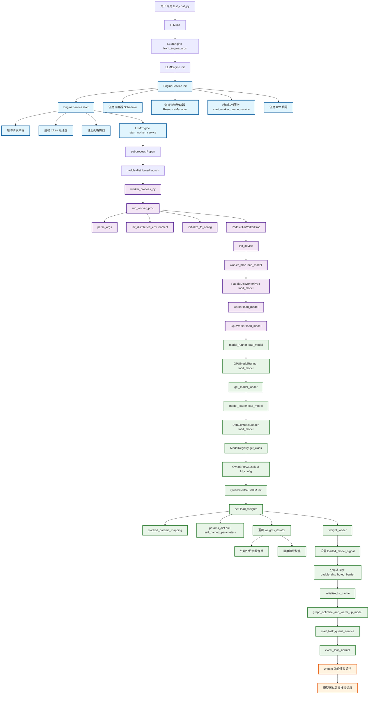
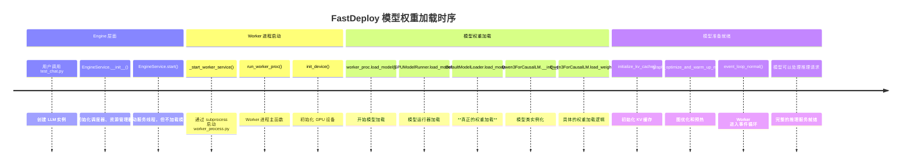

# FastDeploy 模型权重加载完整流程图

根据对 FastDeploy 模型权重加载流程的深入分析，我为你总结了完整的 Mermaid 流程图：

## FastDeploy 模型权重加载完整流程图



## 关键时间节点总结



## 详细步骤说明

### 1. Engine 层面（不加载模型权重）

**文件位置**:

- `fastdeploy/entrypoints/llm.py:73-107`
- `fastdeploy/engine/engine.py:78-95`
- `fastdeploy/engine/common_engine.py:73-166`

**核心功能**:

```python
class EngineService:
    def __init__(self, cfg, start_queue=True):
        # 创建各种管理组件，但不加载模型
        self.scheduler = cfg.scheduler_config.scheduler()
        self.resource_manager = ResourceManager(...)
        self._init_worker_monitor_signals()

    def start(self):
        # 启动服务线程，但仍不加载模型
        self.insert_task_to_worker_thread = threading.Thread(...)
        self.token_processor.run()
```

### 2. Worker 进程启动阶段

**文件位置**: `fastdeploy/engine/engine.py:490-596`

**关键代码**:

```python
def _start_worker_service(self):
    # 使用 paddle.distributed.launch 启动 worker_process.py
    pd_cmd = f"{sys.executable} -m paddle.distributed.launch"
    pd_cmd += " ../worker/worker_process.py"

    # 启动子进程
    p = subprocess.Popen(pd_cmd, shell=True, preexec_fn=os.setsid)
    return p
```

### 3. 模型权重加载阶段

**文件位置**: `fastdeploy/worker/worker_process.py:994`

**执行流程**:

```python
def run_worker_proc() -> None:
    # 1. 分布式环境初始化
    ranks, local_rank = init_distributed_environment()

    # 2. 配置初始化
    fd_config = initialize_fd_config(args, ranks, local_rank)

    # 3. 创建 Worker 进程
    worker_proc = PaddleDisWorkerProc(fd_config, ranks, local_rank)

    # 4. 设备初始化
    worker_proc.init_device()

    # 5. 【关键】模型权重加载
    worker_proc.load_model()  # ← 这里开始加载

    # 6. KV 缓存初始化
    worker_proc.initialize_kv_cache()

    # 7. 图优化和预热
    worker_proc.graph_optimize_and_warm_up_model()
```

### 4. 具体的权重加载实现

**调用链**:

1. `worker_process.py:575` - `PaddleDisWorkerProc.load_model()`
2. `gpu_worker.py:174` - `GpuWorker.load_model()`
3. `gpu_model_runner.py:1312` - `GPUModelRunner.load_model()`
4. `default_loader.py` - `DefaultModelLoader.load_model()`
5. `qwen3.py:257` - `Qwen3ForCausalLM.load_weights()`

**核心权重加载逻辑**:

```python
@paddle.no_grad()
def load_weights(self, weights_iterator) -> None:
    # 1. 分片参数映射（用于合并分离的权重）
    stacked_params_mapping = [
        ("qkv_proj", "q_proj", "q"),      # QKV 投影合并
        ("up_gate_proj", "gate_proj", "gate"),  # 门控投影合并
        # ...
    ]

    # 2. 获取模型参数字典
    params_dict = dict(self.named_parameters())

    # 3. 遍历加载每个权重
    for loaded_weight_name, loaded_weight in weights_iterator:
        # 4. 处理分片合并或直接加载
        weight_loader(param, loaded_weight, loaded_weight_name)
```

## 调试建议

### 1. Worker 进程调试

由于模型权重加载在 Worker 进程中进行，外部调试需要：

```python
# 在 worker_process.py 中添加断点
def run_worker_proc():
    import pdb; pdb.set_trace()  # Worker 启动时会停在这里
    # ... 其他代码
```

### 2. 使用远程调试

```python
# 在 worker_process.py 开头添加
import debugpy
debugpy.listen(5678)
debugpy.wait_for_client()
```

### 3. 关键调试位置

- **Worker 启动**: `worker_process.py:1010`
- **模型加载**: `worker_process.py:994`
- **权重加载**: `gpu_model_runner.py:1317`
- **具体模型**: `qwen3.py:257`

## 架构设计特点

### 1. 多进程分离

- **Engine 进程**: 负责调度、资源管理
- **Worker 进程**: 负责模型加载和推理计算
- **缓存管理进程**: 独立的 KV 缓存管理

### 2. 分布式支持

- 通过 `paddle.distributed.launch` 实现多卡并行
- 支持张量并行、数据并行、专家并行

### 3. 异步处理

- Engine 和 Worker 通过队列和信号通信
- 支持动态权重加载和模型更新

## 总结

FastDeploy 的模型权重加载是一个高度复杂的多进程分布式系统：

1. **Engine 不加载模型**：只负责调度和管理
2. **Worker 加载模型**：通过独立的进程加载权重
3. **分布式启动**：使用 PaddlePaddle 的分布式框架
4. **异步通信**：通过 IPC 信号和队列进行进程间通信

这种架构确保了高性能和可扩展性，但也增加了调试的复杂性。要调试模型权重加载，需要在 Worker 进程内部设置断点。
