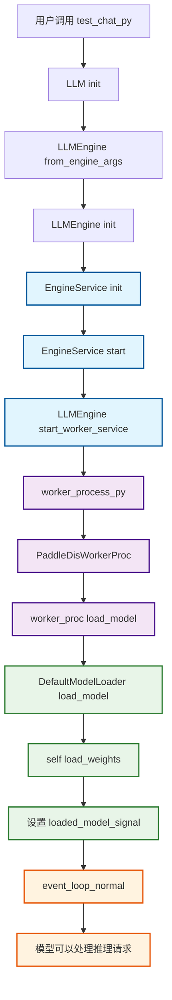

# FastDeploy 简化 Mermaid 测试

这是一个简化版本的流程图，用于测试基本语法:

```mermaid
graph TD
    A[用户调用 test_chat_py] --> B[LLM init]
    B --> C[LLMEngine from_engine_args]
    C --> D[LLMEngine init]
    D --> E[EngineService init]
    E --> J[EngineService start]
    J --> N[LLMEngine start_worker_service]
    N --> Q[worker_process_py]
    Q --> V[PaddleDisWorkerProc]
    V --> X[worker_proc load_model]
    X --> FF[DefaultModelLoader load_model]
    FF --> JJ[self load_weights]
    JJ --> QQ[设置 loaded_model_signal]
    QQ --> VV[event_loop_normal]
    VV --> XX[模型可以处理推理请求]

    classDef engineBox fill:#e1f5fe,stroke:#01579b,stroke-width:2px
    classDef workerBox fill:#f3e5f5,stroke:#4a148c,stroke-width:2px
    classDef loadBox fill:#e8f5e8,stroke:#2e7d32,stroke-width:2px
    classDef modelBox fill:#fff3e0,stroke:#e65100,stroke-width:2px

    class E,J,N engineBox
    class Q,V,X workerBox
    class FF,JJ,QQ loadBox
    class VV,XX modelBox
```

如果这个版本能正常渲染，说明基础语法没有问题。